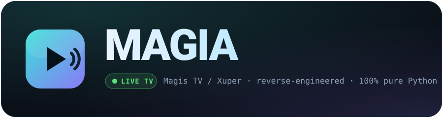

<p align="center">
  
</p>

<p align="center">
  <b>A functional reverse engineering of Magis TV / Xuper</b>, rebuilt 100% in pure Python.<br>
  Search, browse and download movies &amp; series — and now <b>watch live TV</b> — straight from your terminal.<br>
  No Android device, emulator or Frida at runtime.
</p>

<p align="center">
  
  
  
  
  
</p>

## ⚡ Install in one line

**macOS / Linux:**

```bash
curl -sL https://raw.githubusercontent.com/lordmacu/magia/main/install.sh | bash
```

**Windows (PowerShell):**

```powershell
powershell -c "irm https://raw.githubusercontent.com/lordmacu/magia/main/install.ps1 | iex"
```

<sub>Prefer to do it by hand? See <a href="#quick-install">manual install</a>.</sub>

---

## Disclaimer

**This project does not own, operate, host, or distribute any content or servers.** All content accessed through this tool belongs to and is served by the third-party IPTV platform **Magis TV / Xuper** (`com.xuper.netxxus`). This project is purely the result of reverse engineering the Magis TV Android APK for personal educational and research purposes. No media files, streams, or server infrastructure are provided, hosted, or redistributed by this project or its author. Use at your own risk and responsibility.

---

```
  ███╗   ███╗ █████╗  ██████╗ ██╗ █████╗
  ████╗ ████║██╔══██╗██╔════╝ ██║██╔══██╗
  ██╔████╔██║███████║██║  ███╗██║███████║
  ██║╚██╔╝██║██╔══██║██║   ██║██║██╔══██║
  ██║ ╚═╝ ██║██║  ██║╚██████╔╝██║██║  ██║
  ╚═╝     ╚═╝╚═╝  ╚═╝ ╚═════╝ ╚═╝╚═╝  ╚═╝
```

Magia is a **complete, functional reverse engineering** of the Magis TV / Xuper Android app (`com.xuper.netxxus`, aka "Xuper Hydra"). Its encrypted portal protocol, its CDN authorization, and even the live-TV segment signing were cracked and reimplemented from scratch in pure Python. The interactive CLI lets you:

- **Search** for any movie or series by name
- **Browse** the catalog by genre, year, country, or actor
- **Download** movies and full series (auto-organized in folders)
- **View details** — cast, score, description — before deciding to download
- **Get recommendations** — "liked this? try that"
- 📡 **Watch 1,000+ live TV channels** — now streams directly (opens in VLC/mpv); no app, no adb
- **Manage your account** — log in, **register** a new one, or **recover your password**, all from the terminal

No Android device, emulator, adb or Frida is needed at runtime. Everything runs in pure Python.

> ### 📡 New: Live TV actually plays now
> Live was the hardest part of the app to reverse — it used to only print stream credentials. Magia now **plays live channels end-to-end in pure Python**: it resolves the Cloudflare `cfl` CDN, signs every segment with the cracked `sign_o3` routine (emulated with Unicorn), and runs a local HLS proxy so any player just opens `http://127.0.0.1:PORT/live.m3u8`. See **[Live TV Architecture](#live-tv-architecture-)** for the full technical breakdown.

---

## 🧼 Clean & auditable — none of the app's baggage

Magia is **open-source pure Python you can read end-to-end** — no compiled blob running in the background, no obfuscation, no surprises. It deliberately carries **none of the original APK's baggage**:

- ❌ **No telemetry / analytics.** The APK shipped Firebase + analytics interceptors that phoned home on every tap; Magia talks only to the Magis TV API needed to search and play.
- ❌ **No trackers, no ads, no push/notification services.**
- ❌ **No anti-debug / anti-Frida / root-detection** native tricks.
- ❌ **No extra permissions, no background services, no persistence** — it's a script you run and close.
- ✅ **Your data stays local.** Secrets live in a git-ignored `.env`; nothing is uploaded anywhere except the provider's own API/CDN, over your own connection.
- ✅ **Every network call is in the source.** Read it, diff it, audit it — that is the real guarantee against malware, not a promise.

> For live TV, Magia emulates a single native signing routine from the app's `libranger` library **in a sandbox (Unicorn)** — it never installs or executes the original app.

---

## Quick Install

**macOS / Linux:**

```bash
curl -sL https://raw.githubusercontent.com/lordmacu/magia/main/install.sh | bash
```

**Windows (PowerShell):**

```powershell
powershell -c "irm https://raw.githubusercontent.com/lordmacu/magia/main/install.ps1 | iex"
```

Or manually:

```bash
git clone https://github.com/lordmacu/magia.git
cd magia
pip install pycryptodome requests
cp .env.example .env
# Edit .env with your values (see Configuration below)
python3 magia.py
```

## Requirements

- Python 3.8+
- `pycryptodome` — for 3DES encryption
- `requests` — HTTP client

---

## Configuration

All secrets and settings live in `.env` (never hardcoded). Copy the example and fill in your values:

```bash
cp .env.example .env
```

| Variable | Required | Description |
|----------|----------|-------------|
| `IPTV_3DES_KEY` | Yes | 3DES encryption key (48 hex chars) — from APK analysis |
| `IPTV_HOSTS` | Yes | API host(s), comma-separated (primary,fallback) |
| `IPTV_APP_ID` | Yes | APK package identifier |
| `IPTV_DEVICE_SN` | Yes | Device serial number (fingerprint) |
| `IPTV_APK_VERSION` | No | APK internal version code (server accepts empty) |
| `IPTV_DEVICE_DRM_ID` | No | DRM device identifier (server accepts empty) |
| `IPTV_DEVICE_TOKEN` | No | Firebase/push device token (server accepts empty) |
| `IPTV_DEVICE_RESERVE1` | No | Reserved device field (server accepts empty) |
| `IPTV_USERNAME` | No | Account email (for premium tier) |
| `IPTV_PASSWORD` | No | Encrypted password (for premium tier) |
| `IPTV_DOWNLOAD_DIR` | No | Download folder name (default: `downloads`) |

Without a `.env` file, the app will not start — this is by design to prevent leaking secrets into source control.

---

## Usage

### Starting Magia

```bash
python3 magia.py
# or if you ran the installer:
magia
```

You'll see the banner and be asked to choose an authentication method:

```
  ┌────────────────────────────────────────────────┐
  │ Authentication                                 │
  └────────────────────────────────────────────────┘

    1  Free tier (no login)   auto-activates, access to free content
    2  Login with account     email + password for premium content
    3  Register               create an account: email + code + password
    4  Recover password       reset your password via a code sent to email
```

Every step gives you clear feedback — when a code is on its way, when it's waiting for you to paste it, if you left a field empty, if the device couldn't be activated, or if an email is already registered. Registration runs the real flow (`sendEmailVerifyCode` → `validateVerifyCode` → `bindEmail` → `login`) and passwords are hashed exactly like the app does, so the account works both here and in the official app.

### Searching

Pick option **1** from the main menu and type your query:

```
  > Search: dragon ball

  Results (3 of 15):
    1  [SERIE] Dragon Ball                    1986 | ★8.6 | Animation,Action
    2  [PELI]  Dragon Ball Super: Broly       2018 | ★7.9 | Animation
    3  [PELI]  Dragon Ball Super: Super Hero  2022 | ★7.3 | Animation
```

### Movies

When you select a movie, you choose between:

```
    1  Download       download the movie file
    2  View details   full info (cast, description, streams)
```

**View details** shows everything before you commit to downloading:

```
  Year:      2018
  Score:     7.9
  Genre:     Animation,Action,Adventure
  Country:   Japan
  Director:  Tatsuya Nagamine
  Cast:      Masako Nozawa, Ryou Horikawa, Bin Shimada...

  A planet destroyed, a powerful race reduced to nothing...
```

Then asks if you want to download.

### Series

Series episodes auto-organize into their own folder:

```
downloads/
  Dragon_Ball/
    ep001.mp4
    ep002.mp4
    ep003.mp4
    ...
```

You can download all episodes, a range (e.g., 1-10), or a single episode.

### Live TV

Browse 1,000+ channels across 30+ categories and **watch them live** — just like movies and episodes. Pick a channel and Magia opens it in VLC/mpv:

```
  Channel:   ESPN Deportes HD
  > Resolving live stream (CDN cfl)...
  > Signing segments (sign_o3)...
  > Opening in VLC...
```

Under the hood Magia runs a tiny local HLS proxy that re-signs every `.ts` segment on the fly (the provider expires them within seconds), so the player just sees a normal `http://127.0.0.1:.../live.m3u8`. No app, no adb, no emulator — see [Live TV Architecture](#live-tv-architecture-) for how the live path was cracked.

### Browse Options

| Menu | What it does |
|------|-------------|
| **Search** | Search by name |
| **Latest** | Browse newest content (sorted by release date) |
| **By Genre** | Action, Comedy, Horror, Anime, Sci-Fi, etc. |
| **By Year** | Filter by release year |
| **By Country** | Japan, South Korea, USA, Mexico, etc. |
| **By Actor** | Find content by actor or director name |
| **Recommendations** | Pick something you like, get similar titles |
| **Live TV** | 1,000+ channels by category |

### Keyboard Shortcuts

- Type a number to select an option
- `0` goes back
- `Ctrl+C` exits

---

## File Structure

```
magia/
├── magia.py              Main interactive CLI
├── iptv_client.py        IPTV portal API client (encrypted protocol + accounts)
├── live_cfl.py           Live TV resolver + local HLS proxy (re-signs each segment)
├── sign_o3.py            Live segment signer (tweaked-MD5, Unicorn-emulated)
├── svs_cipher.py         SVS auth=/response cipher (the cracked nvuos path, plan B)
├── download_iptv.py      Standalone batch downloader (Dragon Ball)
├── MAGIA_RUNBOOK.md      Full technical runbook — how every value was cracked
├── install.sh            One-line installer script
├── .env                  Your secrets (git-ignored)
├── .env.example          Template for .env
├── .gitignore            Keeps secrets and downloads out of git
└── downloads/            Where your media goes
    └── Dragon_Ball/
        ├── ep001.mp4
        └── ...
```

---

---

# For Nerds

> Technical deep-dive into how Magia works — protocol reverse-engineering, cryptography, CDN architecture, and the full request/response pipeline.

## How It Was Built

Magia was reverse-engineered from a commercial IPTV Android app (`com.xuper.netxxus`, branded as "Xuper Hydra"). The process involved:

1. **Static analysis** — APK decompilation with jadx and apktool
2. **Dynamic analysis** — Frida instrumentation on a rooted Android emulator
3. **Protocol reconstruction** — Pure Python reimplementation of the encrypted API protocol
4. **CDN reverse-engineering** — Cloudflare CDN auth flow for direct HTTP downloads
5. **Live TV signing** — cracked the `sign_o3` segment signature (a tweaked-MD5 native routine, emulated with Unicorn) so live channels play without the app
6. **Account flows** — reproduced login/registration/password-reset, including the exact `MD5(password + "cloudstream")` hashing the app uses

No running Android device or emulator is needed to use Magia — the entire protocol runs in pure Python.

---

## Architecture Overview

```
┌─────────────────────────────────────────────────────────────────┐
│                         MAGIA CLI                               │
│  magia.py — Interactive menus, search, browse, download         │
└────────────┬──────────────────────────────────┬─────────────────┘
             │                                  │
             ▼                                  ▼
┌─────────────────────┐            ┌────────────────────────────┐
│   iptv_client.py    │            │     Direct HTTP Download   │
│   Portal API Client │            │   GET /vod/{id}_media.mp4  │
│                     │            │   Headers:                 │
│  encrypt(json)      │            │     Content-Auth: <cf_tok> │
│  POST /portalCore/* │            │     Content-License: <lic> │
│  decrypt(response)  │            │                            │
└────────┬────────────┘            └──────────┬─────────────────┘
         │                                    │
         ▼                                    ▼
┌─────────────────────┐            ┌────────────────────────────┐
│   IPTV Portal API   │            │   Cloudflare CDN           │
│   (osuhk.m3x8o50te  │            │   (yuwc.swzablvpm.com)     │
│    .com)             │            │   sign_type=cfl            │
│                     │            │                            │
│  activate / login    │            │  Serves .mp4 / .ts files   │
│  search / detail     │            │  with auth token           │
│  play_vod / get_slb  │            │                            │
│  live_data / etc     │            │                            │
└─────────────────────┘            └────────────────────────────┘
```

---

## The Encryption Protocol

Every request and response is encrypted with **3DES-ECB** (Triple DES in Electronic Codebook mode). The encoding pipeline:

```
                    ENCODING (request body)
┌──────────┐    ┌──────────┐    ┌──────────┐    ┌──────────┐
│   JSON   │───▶│  3DES    │───▶│  Base64  │───▶│   Hex    │
│ plaintext│    │ ECB/PKCS5│    │  encode  │    │  encode  │
└──────────┘    └──────────┘    └──────────┘    └──────────┘
                                                     │
                                              wire format
                                              (POST body)
                                                     │
                    DECODING (response .data)         ▼
┌──────────┐    ┌──────────┐    ┌──────────┐    ┌──────────┐
│   JSON   │◀───│  3DES    │◀───│  Base64  │◀───│   Hex    │
│ plaintext│    │ ECB/PKCS5│    │  decode  │    │  decode  │
└──────────┘    └──────────┘    └──────────┘    └──────────┘
```

The 3DES key is a 24-byte (192-bit) key stored in the `.env` file. It was extracted from the APK's native code via Frida instrumentation of the `DES3.new()` call path.

**In code (simplified):**

```python
from Crypto.Cipher import DES3
from Crypto.Util.Padding import pad, unpad

def encrypt(json_str):
    ct = DES3.new(KEY, DES3.MODE_ECB).encrypt(pad(json_str.encode(), 8))
    return base64.b64encode(ct).decode().encode().hex()

def decrypt(wire):
    ct = base64.b64decode(bytes.fromhex(wire).decode())
    return unpad(DES3.new(KEY, DES3.MODE_ECB).decrypt(ct), 8).decode()
```

---

## VOD Download Flow

Downloading a movie or episode requires three API calls followed by a direct HTTP download:

```
Step 1: activate()              Step 2: get_slb()
┌───────────────────┐           ┌───────────────────┐
│ POST v8/active    │           │ POST getSlbInfo    │
│                   │           │                   │
│ IN:  device SN,   │           │ OUT: cdn_list[] → │
│      DRM ID       │           │   tag: "vod"      │
│                   │           │   main_addr: CDN   │
│ OUT: userToken,   │           │   url: CF auth tok │
│      userId       │           │   sign_type: cfl   │
└───────┬───────────┘           └───────┬───────────┘
        │                               │
        ▼                               ▼
Step 3: play_vod()              Step 4: HTTP GET
┌───────────────────┐           ┌───────────────────┐
│ POST startPlayVOD │           │ GET /vod/{media}   │
│                   │           │     _media.mp4     │
│ IN:  contentId    │           │                   │
│                   │           │ Headers:           │
│ OUT: episodeList  │           │  Content-Auth:     │
│  └─ movieList     │           │    <cf_auth_token> │
│     └─ contentId  │           │  Content-License:  │
│        (media_code)│          │    <vod_license>   │
│     └─ license    │           │                   │
│     └─ videoFormat│           │ → 200 OK          │
│        (mp4/ts)   │           │   binary stream   │
└───────────────────┘           └───────────────────┘
```

**Key insight:** The CDN auth token from `get_slb()` and the license from `play_vod()` are interchangeable across sessions. This means:
- Tokens from one session work in another
- Auth tokens have a ~48-hour lifetime
- The token refreshes automatically every 30 episodes

---

## Content Discovery

The portal API has multiple endpoints for content, but in practice **only `search()` works reliably** for browsing:

| Endpoint | Works? | Notes |
|----------|--------|-------|
| `search(query, page, size)` | Yes | 44,054 items, paginated, sorted by releaseTime desc |
| `filterGenre()` | Yes | Returns genre/year/country catalogs (metadata only) |
| `v4/getItemData` | Yes | Full item details |
| `similar(contentId)` | Yes | Recommendations |
| `searchResourceOrPerson` | Partial | Returns results, but `items_by_person` returns 0 |
| `getShelveData` | No | Returns empty for VOD columns |
| `getColumnContents` | No | Returns empty for type=3 columns |
| `filterByContent` | No | Returns error |

**Browse trick:** Searching for `"s"` (a single letter) returns the full catalog sorted by newest first — this is how "Latest" browsing works.

---

## Live TV Architecture ⭐

> **This is Magia's flagship capability.** Live TV was the hardest part of the app to reverse — and it now plays end-to-end in pure Python, no app, adb or emulator. Here is exactly how it works.

Live channels are organized in categories, then resolved to a playable stream:

```
live_categories()          live_data(column_id)        play_live(channel_code)
┌────────────────┐         ┌────────────────┐          ┌────────────────────┐
│ GET liveColumn │ ──────▶ │ GET liveData   │ ───────▶ │ POST startPlayLive │
│                │         │                │          │                    │
│ Returns:       │         │ Returns:       │          │ Returns:           │
│  30+ categories│         │  channels[]    │          │  liveAddressList[] │
│  (Sports, News,│         │  with codes    │          │    playCode        │
│   Movies, etc.)│         │                │          │    license (DRM)   │
└────────────────┘         └────────────────┘          └────────────────────┘
```

### The dead end, then the breakthrough

The official player hides live behind an **SLB / `nvuos` binary protocol**: `GET /slb/v9/live` guarded by a proprietary `auth=` query cipher, resolving to a P2SP/`nvuos` transport. That cipher was fully cracked (AES-128-CBC with a **non-standard base64 alphabet**, see [`svs_cipher.py`](svs_cipher.py) and the runbook) — but it was a rabbit hole.

The breakthrough: **live rides the exact same Cloudflare CDN as VOD**, exposed by `sign_type=cfl` in the SLB response. That path is plain HLS over HTTPS — no `nvuos`, no P2SP. So live reuses the VOD machinery, plus one extra trick: **per-segment signing**.

### End-to-end resolution (what `live_cfl.py` does)

```
STEP 1 — license            STEP 2 — cfl endpoint (getSlbInfo, type="merge")
┌───────────────────┐       ┌──────────────────────────────────────────┐
│ play_live(channel)│       │ cdn_list[] → entry with tag="live"         │
│  → liveAddressList│       │              sign_type="cfl"               │
│     [0].license   │       │   main_addr = <cfl host>  (ROTATES per call│
│  (Content-License)│       │               e.g. niguof.vynbszicd.com)   │
│                   │       │   url       = Content-Auth base            │
│                   │       │               ...&token=<32 hex UPPERCASE> │
└─────────┬─────────┘       └───────────────────────┬────────────────────┘
          │                                         │
          └──────────────┬──────────────────────────┘
                         ▼
STEP 3 — playlist                       STEP 4 — segment (per .ts)
┌────────────────────────────────┐      ┌────────────────────────────────────┐
│ GET http://<cflhost>/live/     │      │ GET <seghost>/live/<ch>/<ch>_shisui │
│         <channel>.m3u8         │      │        _<ts>.ts?<baseauth>          │
│ Headers:                       │      │   &sign2_method=sign_o3             │
│  Content-Auth:    <url>        │ ───▶ │   &instance=0                      │
│  Content-License: <license>    │      │   &start_moment=<epoch_ms>         │
│  User-Agent: Ranger/4.9.4-…    │      │   &sign2=<sign_o3(token, moment)>  │
│                                │      │ Headers: same Content-Auth/License │
│ → m3u8 with ABSOLUTE segment   │      │ → 200 OK, MPEG-TS (first byte 0x47)│
│   URLs on rotating seg hosts   │      │   Segments EXPIRE in seconds       │
└────────────────────────────────┘      └────────────────────────────────────┘
```

### `sign2` / `sign_o3` — the per-segment signature

Every `.ts` request must carry a fresh `sign2`. The app computes it inside the native `libranger-jni.so` with a **tweaked MD5** (a non-standard MD5 whose compression constants are patched), so a plain `hashlib.md5` does *not* reproduce it. It was recovered by:

1. **Frida** hooking `MD5_Update` (vaddr `0x529044`) to dump the exact message being hashed, revealing the layout:
   ```
   msg = f"token={TOKEN}&sign2_method=sign_o3&instance=0&start_moment={MOMENT}" + SALT
   SALT = b"salt3333=4" + bytes.fromhex("980d0a1532c9c3821708c0")
   ```
2. **Unicorn** emulating the tweaked-MD5 compression function (vaddr `0x529178`) directly out of the `.so`, so Python produces byte-identical digests without the constants.
3. Verifying `sign_o3(token, moment)` against real captured `(token, start_moment, sign2)` triples.

The result is [`sign_o3.py`](sign_o3.py): `sign2 = tweaked_md5(msg)`, pure Python via Unicorn.

### Local HLS proxy (why re-signing is required)

Because each segment's `sign2` binds to a `start_moment` and the CDN **expires segments within seconds**, you can't hand a player a static m3u8. So `live_cfl.py` runs a tiny **local HLS proxy**:

```
VLC / mpv ──▶ http://127.0.0.1:PORT/live.m3u8
                     │
                     ▼
        live_cfl proxy  ──▶  fetches upstream m3u8 (fresh)
                     │        rewrites each segment URL to a local path
                     ▼
        on each /seg request ──▶ signs sign_o3(token, now_ms)
                                  fetches <seghost>/…&sign2=… ──▶ streams TS back
```

The player only ever sees a normal local playlist; the proxy re-signs and refreshes on demand. Run it standalone with:

```bash
python3 live_cfl.py <channel_code> --play      # resolves + proxy + opens the player
```

**Everything above is dynamic per session** — hosts, token, license and moments all come from the live API and must never be hardcoded. If the provider rotates the `sign_o3` SALT or schedule, re-derive it with the Frida/Unicorn recipe in [`MAGIA_RUNBOOK.md`](MAGIA_RUNBOOK.md) §5–§7 (the runbook documents how *every* value was obtained and re-obtained).

---

## Device Fingerprinting

Every API request includes a device fingerprint injected by the app's network interceptor (class `C6357b` in the decompiled source). These fields are required — without them, the API returns auth errors:

```json
{
  "loginType": "2",
  "appLanguage": "en",
  "apkVersion": "49902",
  "appId": "com.android.msandroid",
  "hardwareInfo": "ranchu",
  "model": "sdk_gphone64_arm64",
  "sn": "<device serial from .env>",
  "drmId": "<DRM ID from .env>",
  "deviceToken": "<Firebase token from .env>",
  "reserve1": "<encoded field from .env>"
}
```

These values were captured from a running emulator instance. The `sn` (serial number) is the primary device identifier — the server uses it to track activations.

---

## Format Handling

Content is available in two format combinations:

| Video Format | Container | Codec | Priority |
|-------------|-----------|-------|----------|
| `mp4` | `.mp4` | H.264 | Preferred |
| `ts` | `.ts` | H.265/HEVC | Fallback |

Magia always tries H.264/MP4 first (smaller files, universal compatibility) and falls back to H.265/TS when H.264 isn't available.

---

## Rate Limiting

The portal API enforces rate limits. Magia respects them:

| Operation | Delay |
|-----------|-------|
| API calls (search, detail, play_vod) | 1.5 seconds |
| Between downloads | 0.5 seconds |
| CDN auth refresh | Every 30 episodes |
| Session re-activation | On 401/token expiry |

---

## Reverse Engineering Methodology

### Phase 1: Static Analysis (jadx + apktool)

The APK was decompiled to Java source. Key discoveries:

- **Entry point:** `com.xuper.netxxus` → routes through ARouter to portal activities
- **Network layer:** OkHttp interceptor `C6357b` adds device fields to every request
- **Crypto:** `DES3.new()` with ECB mode, PKCS5 padding, key from native `.so`
- **Protocol:** All payloads go through `hex(base64(3DES(json)))` transformation
- **Headers:** `apk`, `apkVer`, `spkgVer` are mandatory (missing → "version stopped" error)

### Phase 2: Dynamic Analysis (Frida)

Frida scripts (included in the repo for reference) were used to:

1. **Hook `NativeJni.Call()`** — intercepted all Ranger player operations
2. **Hook `java.net.URL`** — captured CDN URLs and auth patterns
3. **Hook OkHttp** — logged all non-analytics HTTP traffic
4. **Hook `Sources` entity** — captured media_code, auth, license in real-time
5. **Anti-Frida bypass** — patched `strstr()` and `openat()` to hide Frida's presence

### Phase 3: Protocol Reimplementation

With the crypto key and protocol structure understood, the entire flow was reimplemented in pure Python (~400 lines). The Frida scripts are no longer needed for operation — they're included for documentation.

### Key Files from RE Process

| File | Purpose |
|------|---------|
| `frida_vod_capture.js` | Full VOD flow capture (SLB + CDN hooks) |
| `frida_rpc_agent.js` | RPC agent for VOD resolution via Ranger |
| `frida_play_vod.js` | Standalone VOD playback injection |
| `frida_cdn_hook*.js` | CDN URL and auth capture variants |
| `test_proxy.sh` | Local proxy testing script |

---

## API Endpoint Reference

All endpoints are POST to `https://{host}/api/portalCore/{route}`:

| Route | Description | Key Parameters |
|-------|-------------|----------------|
| `v8/active` | Device activation (free tier) | `snToken`, `macAddr`, `reserve1` |
| `v3/loginByAccount` | Account login | `userName`, `password`, `accountType` |
| `v10/startPlayVOD` | Get VOD stream info | `contentId`, `seriesContentId` |
| `v4/startPlayLive` | Get live stream info | `channelCode`, `columnId` |
| `getSlbInfo` | Get CDN/SLB servers | (device fields only) |
| `v4/getItemData` | Content details | `contentId`, `type` |
| `search` | Search catalog | `query`, `pageSize`, `pageNum` |
| `filterGenre` | Get filter options | (device fields only) |
| `getSimilarContentByContentId` | Recommendations | `contentId` |
| `searchResourceOrPerson` | Search people | `query` |
| `liveColumn` | Live TV categories | (device fields only) |
| `liveData` | Channels in category | `columnId`, `pageSize` |

---

## Security Notes

- All secrets are stored in `.env` (git-ignored)
- No credentials are hardcoded in source code
- The 3DES key, device fingerprint, and API hosts are all externalized
- SSL verification is disabled (`verify=False`) because the portal uses a custom certificate chain
- CDN auth tokens expire in ~48 hours and auto-refresh

---

## Disclaimer

**This project does not own, operate, host, or distribute any content or servers.** All content accessed through this tool belongs to and is served by the third-party IPTV platform **Magis TV / Xuper** (`com.xuper.netxxus`). This tool is the result of reverse engineering the Magis TV Android APK for personal educational and research purposes only. No media files, streams, or server infrastructure are provided, hosted, or redistributed by this project or its author.

## License

For educational and research purposes only.
